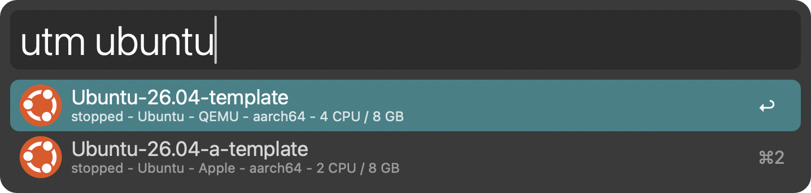
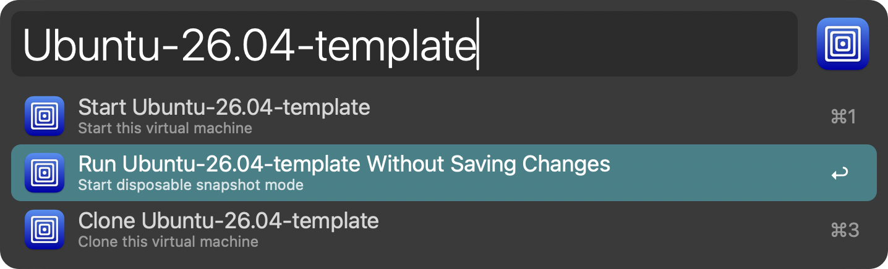

# Alfred-UTM-Control

Search and control UTM virtual machines from Alfred. Browse VM status and details, start or suspend a VM, request shutdown, and even clone a VM.

## Requirements

- macOS with [Alfred 5 and the Powerpack](https://www.alfredapp.com/powerpack/).
- [UTM](https://mac.getutm.app/) with its bundled `utmctl` command and VMs registered in UTM.

**Tested:** Alfred 5 and UTM v5.0.5 on macOS 26 and 27.

**Expected compatibility:** any macOS version compatible with Alfred 5 and with any UTM versions that have `utmctl`.

## Installation

Download the `.alfredworkflow` attachment from [Releases](https://github.com/ideologysec/alfred-utm-control/releases) and double-click to open it in Alfred, or use the Import Workflow button. Be sure to download the `.alfredworkflow` attachment, not GitHub's source ZIP.

Install updates by downloading and opening the newer workflow attachment. The workflow has no self-updater.

## Browse VMs

Type `utm` followed by one space to show all VMs. Continue typing a search term, such as `utm ubuntu`, to filter by VM name, OS, backend, or architecture. Listing and selecting a VM does not start or stop it.

Select a VM and press **Return** to open its status-aware action list, then press **Return** on an action to run it. Results show live status and available metadata: OS, QEMU or Apple virtualization backend, architecture, CPU count, and memory.

- Stopped, suspended, and paused VMs offer **Start**.
- Running or started VMs offer **Stop**, **Force Stop**, **Suspend**, and **IP Address**.
- **Clone** prefills the selected VM's name so you can edit it into a variation before confirming. The name must not be empty.
- **IP Address** reports what `utmctl` returns, via a system notification. The guest must be running.

**Stop requests a guest shutdown. Force Stop powers off immediately and can lose unsaved work or damage guest data.** UTM may reject actions that the VM or backend does not support.

## Direct actions and modifiers

Use `utm start`, `utm stop`, or `utm suspend` to select a VM and perform that action directly. Each keyword accepts an optional search term; without one, it lists all eligible VMs.

- `utm start` lists stopped, suspended, and paused VMs.
- `utm stop` and `utm suspend` list running or started VMs.
- **Command–Return** on a start result or start action reverses the configured bring-to-front behavior for that launch.
- **Option–Return** on a QEMU result under `utm start` switches between normal and disposable mode for that launch.
- **Command–Option–Return** on a QEMU result under `utm start` reverses both settings.

The browse action list also offers **Run Without Saving Changes** for recognized QEMU VMs. This passes UTM's `--disposable` option. Do not use it for work you intend to keep. Apple virtualization VMs do not have this option, as it is not supported by macOS (yet). ***The disposable-default setting only affects the `utm start` shortcut, not the separate explicit actions in the browse list.***

## Configuration

Open **Configure Workflow** in Alfred to set:

- **Keyword:** the base keyword, default `utm`. Changing it changes the browse and direct-action keywords. For example, choosing `vm` gives `vm`, `vm start`, `vm stop`, and `vm suspend`.
- **Bring UTM to the front:** on by default after a successful start.
- **Action notifications:** on by default. Keep them enabled for action feedback.
- **Disposable QEMU starts:** off by default; applies to the direct start shortcut.

### Nonstandard paths

The workflow uses these defaults. For a nonstandard installation, add or set the corresponding environment variables in Alfred's workflow editor to the appropriate absolute paths; these are advanced overrides, not Configure Workflow fields.

- `UTMCTL_BIN`: `/Applications/UTM.app/Contents/MacOS/utmctl`
- `UTM_DOCS_DIR`: `~/Library/Containers/com.utmapp.UTM/Data/Documents`
- `UTM_ICON_DIR`: `/Applications/UTM.app/Contents/Resources/Icons`

Bringing UTM forward uses macOS' `open -a UTM`.

## Known limitations

- Each new keyword invocation reads live state from `utmctl`. Alfred filters the results locally as you type; an open list does not poll. Reopen the keyword after changing a VM's state.
- Only configuration metadata is cached, not live status.
- Metadata comes from `*.utm/config.plist` immediately inside `UTM_DOCS_DIR`. Externally stored VMs can still be listed and controlled, but may lack hardware details, backend information, and guest icons. Disposable-start options require recognized QEMU metadata.
- The workflow does not resolve external VM bookmarks or display custom guest icons. Stock guest icons come from the installed UTM application.

## Support

[Report a bug or request a feature](https://github.com/ideologysec/alfred-utm-control/issues). Include the workflow, Alfred, and UTM versions, the keyword/action used, and relevant Alfred debugger output. Remove private VM names, paths, and IP addresses before sharing logs.

For troubleshooting, set `UTM_DEBUG=1` to include timing messages in the debugger, or `UTM_CACHE_DISABLE=1` to bypass the metadata cache.

UTM scripting errors are reported as failures even when `utmctl` exits zero. Other stderr diagnostics remain in Alfred's debugger rather than becoming VM names or IP addresses. Unreadable VM metadata does not prevent listing or controlling that VM.

## Development and testing

The maintainer created this workflow with help from large language models (LLMs). The human maintainer is responsible for reviewing the code, validating its behavior, and testing releases.

## License

The workflow's original code uses the [MIT License](LICENSE). The UTM icon uses [Apache License 2.0](LICENSE-UTM); see [Attribution](ATTRIBUTION.md). Alfred-UTM-Control is an independent workflow, not an official UTM or Alfred product.
